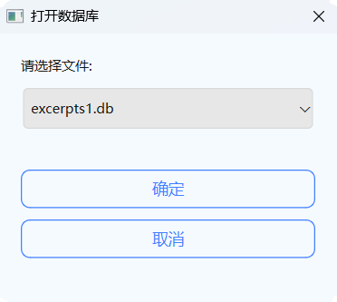
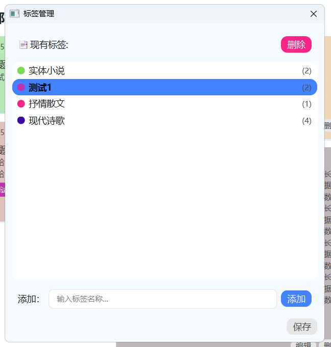
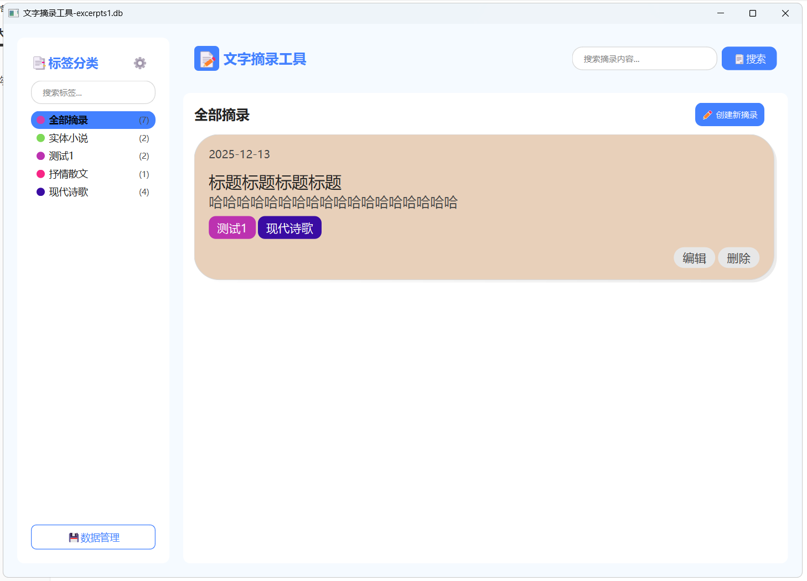
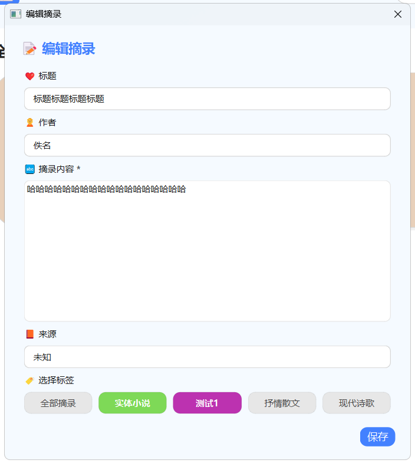
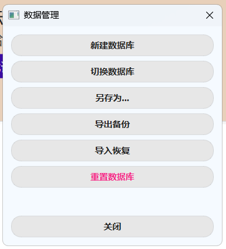
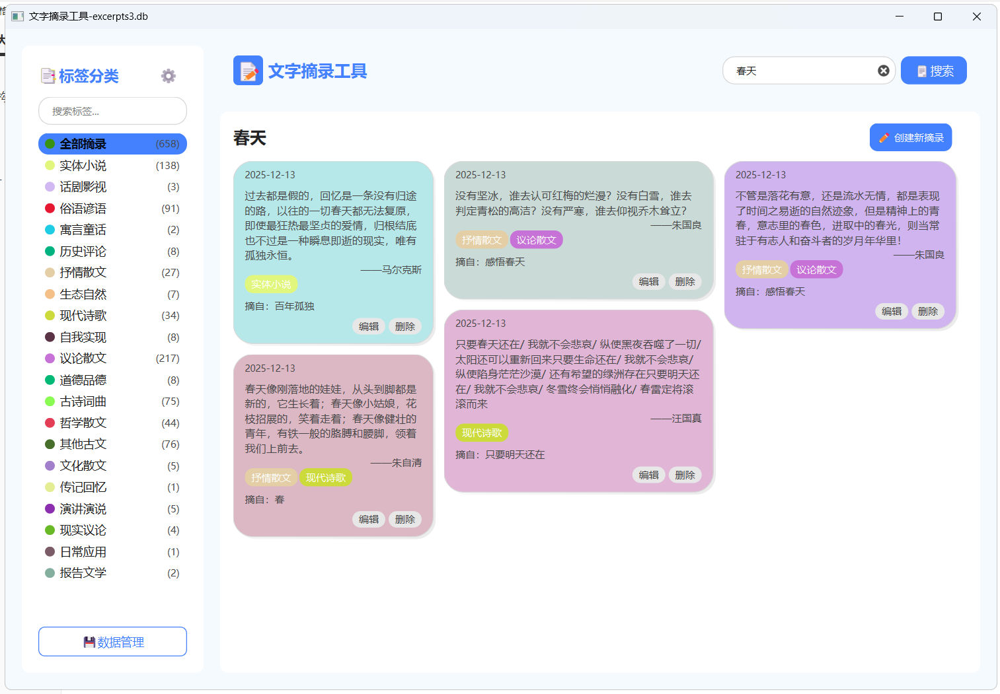
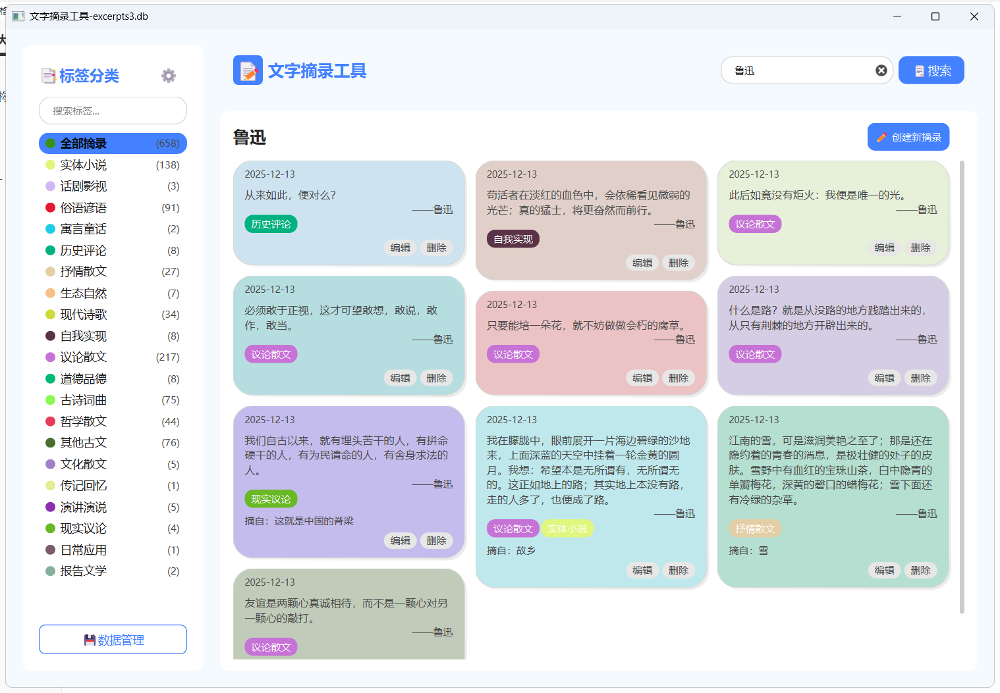
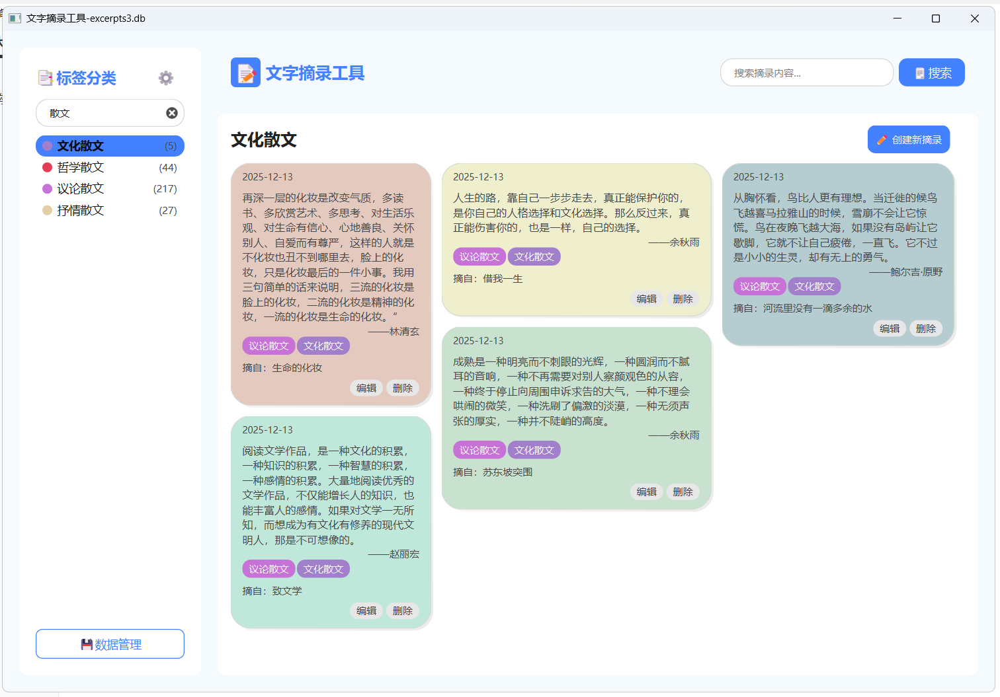

[English](README.md) | [中文](#)

### 文本摘录工具

本程序用于摘录文本片段。程序存储采用Sqlite，程序界面采用pyside6。

### 摘录片段数据的结构

摘录片段结构如下

```md
标签：以#开头（文件开头的#，换行+#，标签行的#），一行或多行，每个标签必须在一行内完成且仅包含中英文、数字和运算符，多个标签可以分布在多行，直至其他标识。
创建时间：以%开头，一行。
来源：以@开头（换行+@），一行。
标题：以‘《》’包括（换行+《），一行。
作者：作者应以‘作者：’开头（换行+作者：），一行。
正文：无开头标识符，多行，空行不计，直至其他标识。
正文角标：正文中以‘[]’标注，仅包含中英文、数字。
注释：以‘注释：’开头（换行+注释：），多行，空行不计，直至其他标识。
相关：以‘相关：’开头（换行+相关：），多行，空行不计，直至其他标识。
附件：以‘相关：’开头（换行+附件：），多行，空行不计，每行一条，直至其他标识。
```

注：正文角标属于正文，仅渲染模式不同。

注：ui未实现 注释、相关和附件 三项内容渲染。

### 开始程序

运行[main.py](main.py)即可启动程序。

或运行下面命令启动并打开某个文件：

```python
from excerpts import run

run(file_name="excerpts1.db")
```




### 标签编辑

点击“标签分类”右侧的“⚙️”即可打开标签编辑界面。

- 选中标签后—删除标签
- 选中标签后—拖动排序
- 双击标签后—修改名称
- 输入标签名称添加新标签
- 保存标签修改




### 卡片编辑放大

单击卡片即可放大。

再单击缩小。



### 卡片编辑/新建卡片

点击卡片右下角的“编辑”即可打开卡片编辑界面。

点击“创建新摘录”即可新建卡片。



### 数据管理

点击“数据管理”即可管理数据库和文件。

- 新建数据库
- 切换数据库
- 另存为...
- 导出数据
- 导入数据
- 重置数据库



### 搜索摘录

在搜索框输入内容点击搜索即可进行搜索。

搜索不支持搜索标签内容，搜索标签需要在标签面板进行搜索。





### 搜索标签

在标签面板进行搜索。



### 批量录入

- 导入备份的数据

通过”数据管理-导出数据“备份的json文件，可以通过”导入数据“批量合并到当前数据集。

- 使用python程序

[add_test.py](add_test.py)程序可以批量录入格式化的json摘录。

```python
from excerpts import run

run(file_name="excerpts3.db", tags = tags, excerpts = excerpts)
```

[parse_quotes_file_tool.py](parse_quotes_file_tool.py)程序可以批量格式化符合“摘录片段数据的结构”的文字段落。
